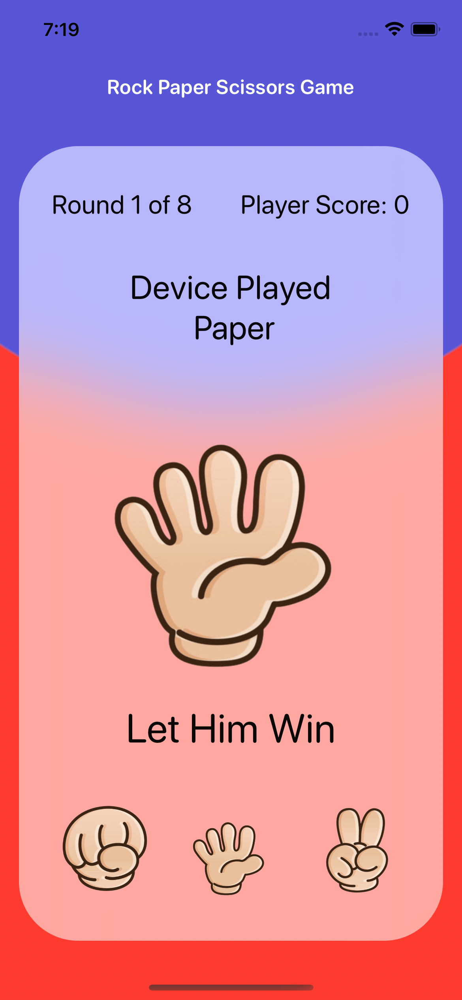

<h1 style="text-align: center;margin-bottom: 5px;">Hey, What's up? I'm Omar </h1>

<h3 align="left">Connect with me:</h3>

📫 Reach me on **omr11kk@gmail.com**

<h3 align="left">Languages and Tools:</h3>

    
    
    
    
    
    
    
    
    
    
    
    
    
    
    
  

  

