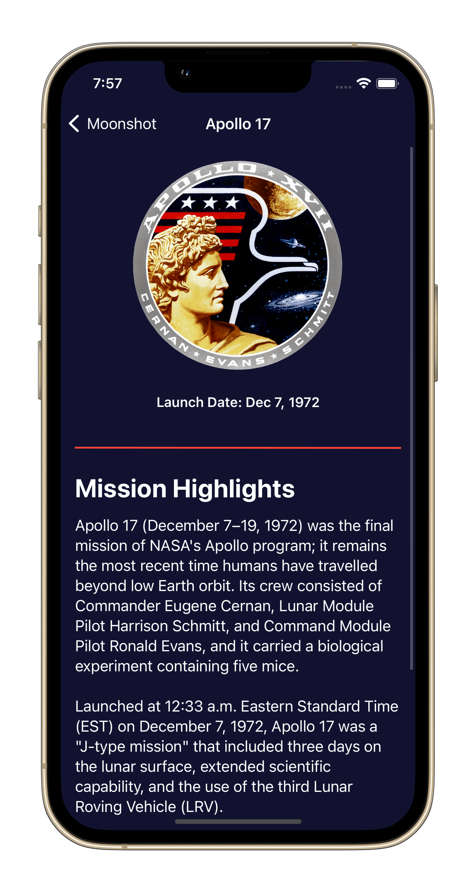
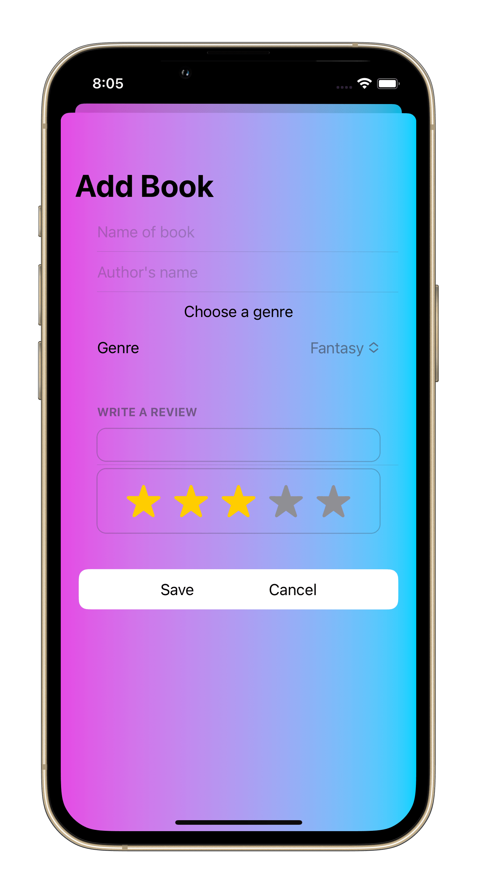

# Simple Rock Paper Scissors Game

# Simple Geuss the Flag Game

# Moonshoot app
An app showing all NASA Apollo missions with information and logos

# Core Data app
An app implement CoreData and using sorting from fetch request techniques

# Bookworm app
Write a quick book review through this app..all the data saved using CoreData

