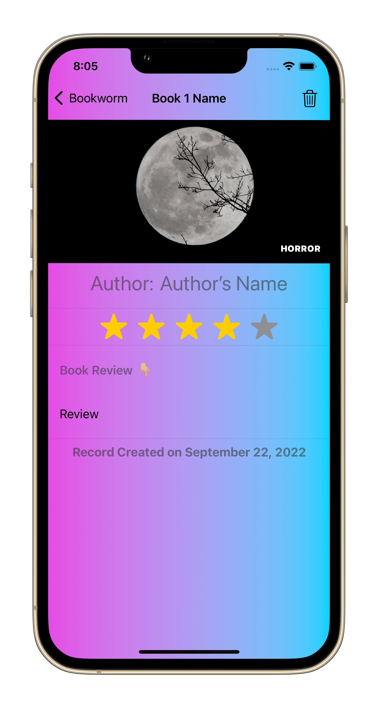

# Rock Paper Scissors Game and Geuss the Flag Game
[Rock Paper Scissors project files here](https://github.com/omr1k/iOS_Projects/tree/main/RockPaperScissors)

[Guess The Flag project files here](https://github.com/omr1k/iOS_Projects/tree/main/GuessTheFlag)

# Moonshoot app
An app showing all NASA Apollo missions with information and logos, [Check project files here](https://github.com/omr1k/iOS_Projects/tree/main/Moonshot)

# Core Data app
An app implement CoreData and using sorting and feltring from fetch request techniques, [Check project files here](https://github.com/omr1k/iOS_Projects/tree/main/CoreDataProject)

# Bookworm app
Write a quick book review through this app...all the data saved using CoreData, [Check project files here](https://github.com/omr1k/iOS_Projects/tree/main/Bookworm)

# FriendFace app
Fetch data from the Internet using URLsession then cached it within the app using CoreData, [Check project files here](https://github.com/omr1k/iOS_Projects/tree/main/FriendFace) 

# Habit Tracking app
Track your habits with this app and how many days you did this habits...all data saved using user defaults, [Check project files here](https://github.com/omr1k/iOS_Projects/tree/main/HabitTracking)

# Filter app
In this app I used CoreImage to apply diffrent filters to an image and also implment uiviewcontrollerrepresentable to wrap PHPhotoPicker to use it within swiftUI, [Check project files here](https://github.com/omr1k/iOS_Projects/tree/main/Instafilter) 

# Never Forget Names  app
In this app I Implemented Mapkit, CoreData, Fetching user location, UIViewControllerRepresentable, PHPickerViewControllerDelegate, Saving and deleting files to documents directory, [Check project files here](https://github.com/omr1k/iOS_Projects/tree/main/NeverForgetNames)

