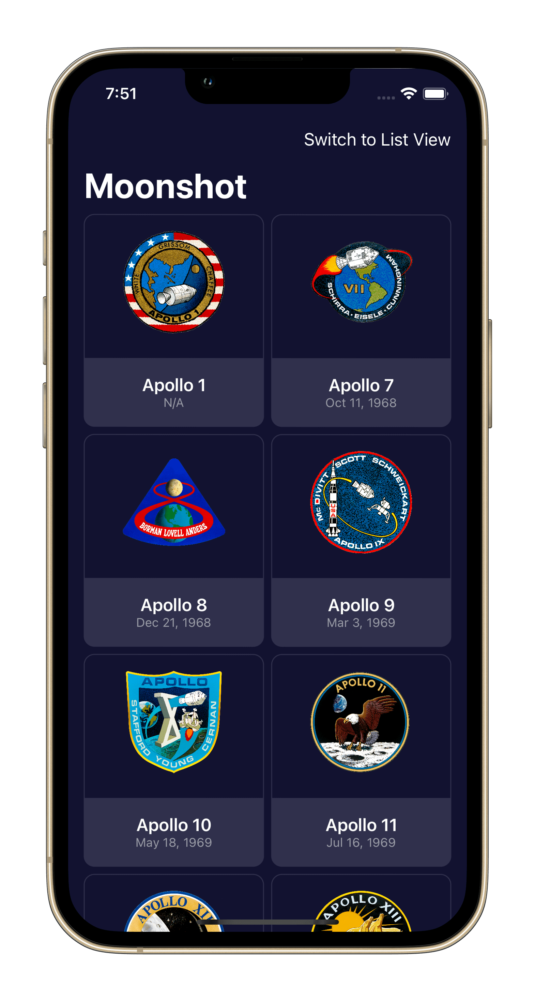
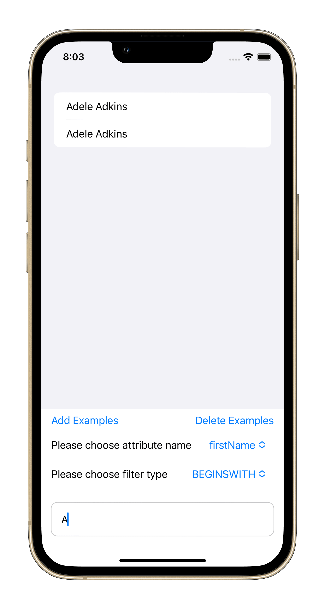
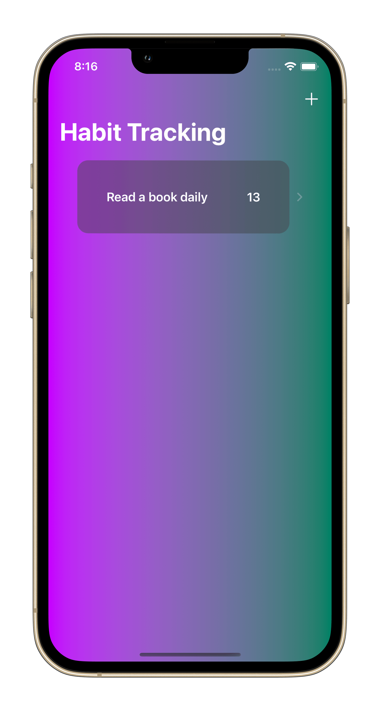
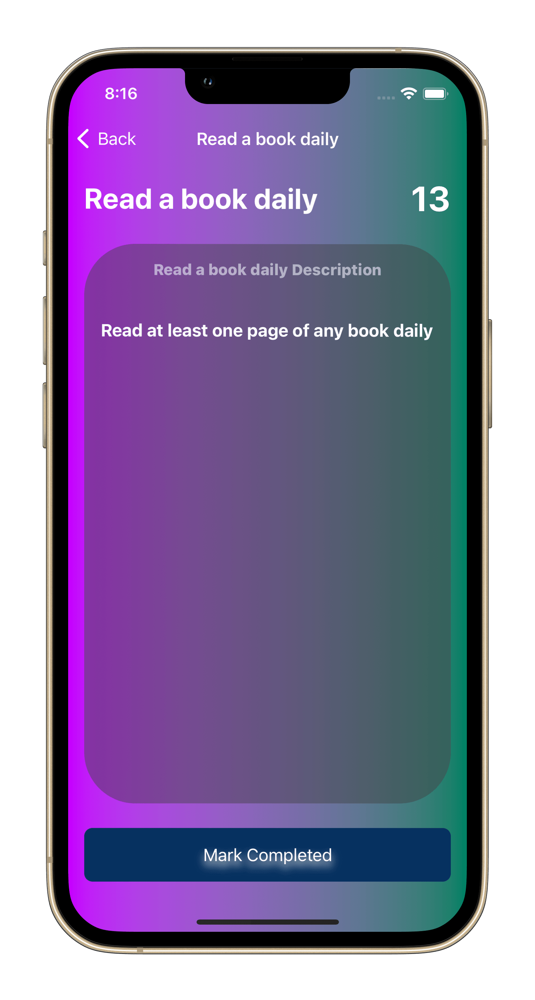

# Rock Paper Scissors Game and Geuss the Flag Game

# Moonshoot app
An app showing all NASA Apollo missions with information and logos

# Core Data app
An app implement CoreData and using sorting from fetch request techniques

# Bookworm app
Write a quick book review through this app...all the data saved using CoreData

# FriendFace app
Fetch data from the Internet using URLsession then cached it within the app using CoreData 

# Habit Tracking app
Track your habits with this app and how many days you did this habits...all data saved using user defaults

# Filter app
In this app I used CoreImage to apply diffrent filters to an image and also implment uiviewcontrollerrepresentable to wrap PHPhotoPicker to use it within swiftUI 

