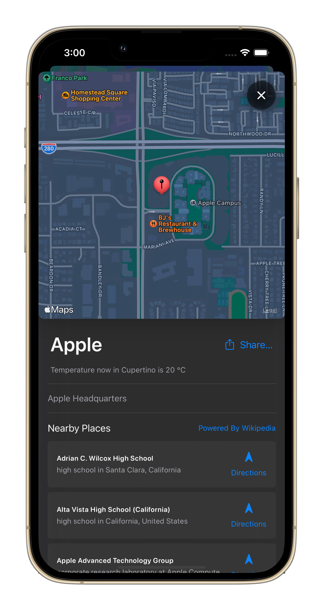
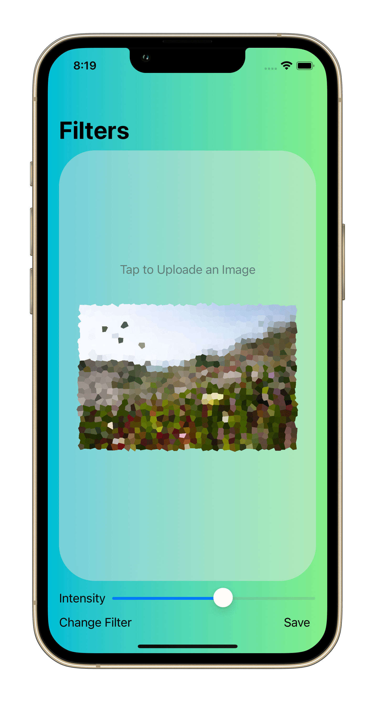
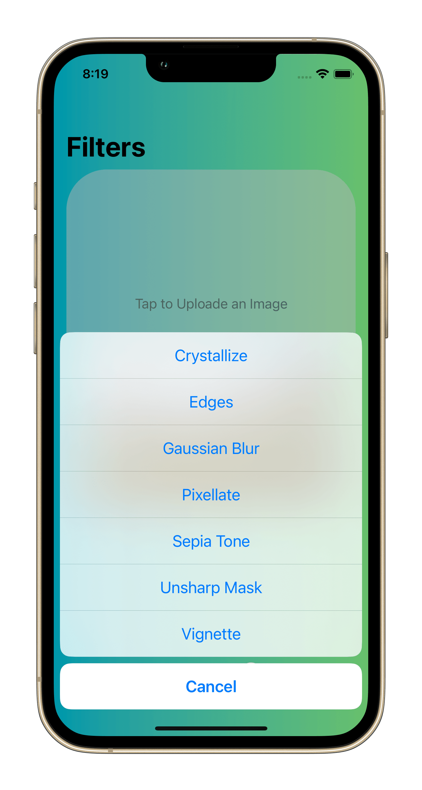
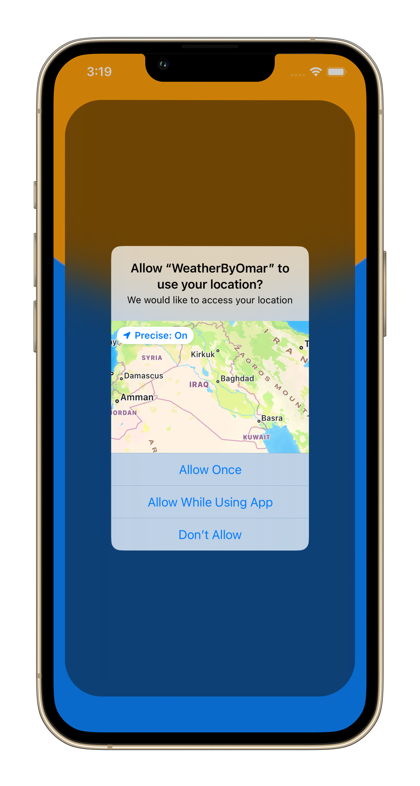
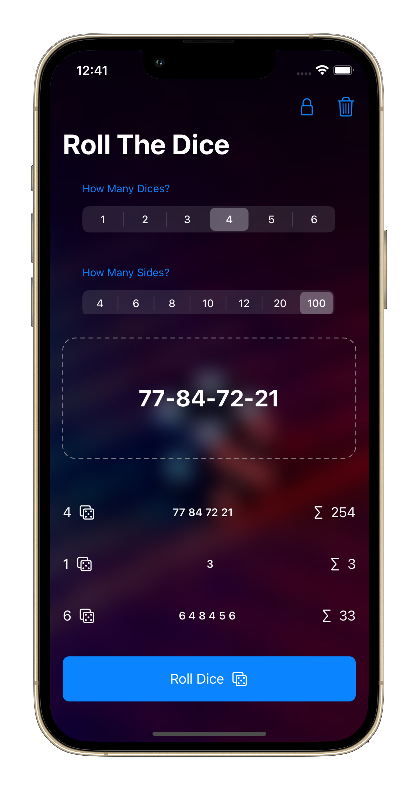
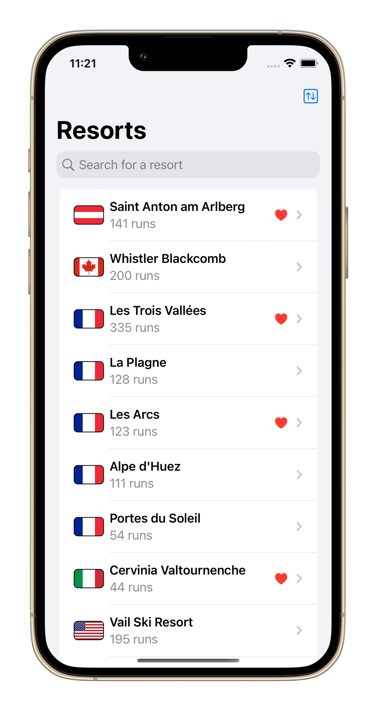
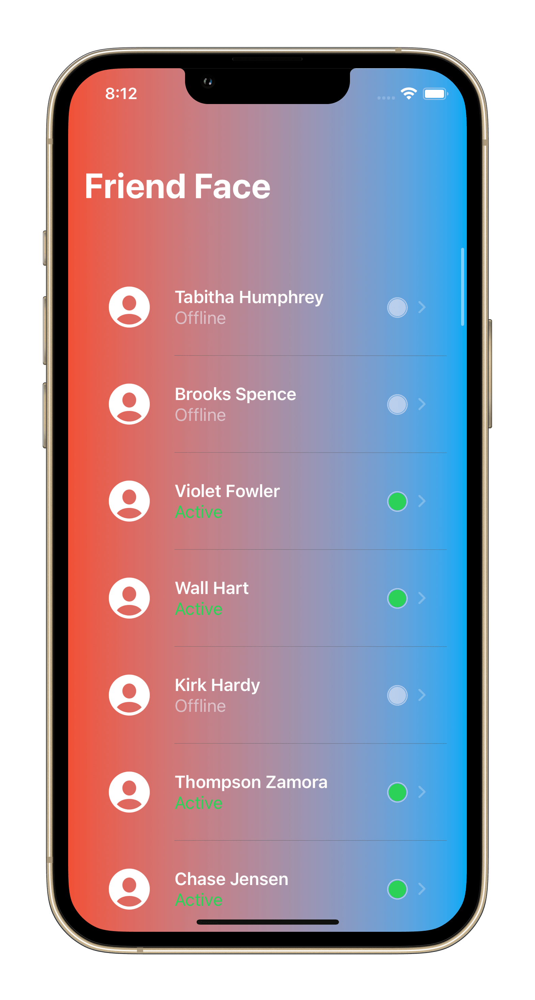

# Hola Pins
In this app I Implemented MVVM, Mapkit, Fetching user location, saving to documents directory, SwifUI sheets, iOS 16 share sheet, Integrate with wikipedia nearby api, Integrate with open weather map api, Integrate with Geoapify api, [Check project files here](https://github.com/omr1k/iOS_Projects/tree/main/MapApp)

# Never Forget Names  app
In this app I Implemented Mapkit, CoreData, Fetching user location, UIViewControllerRepresentable, PHPickerViewControllerDelegate, Saving and deleting files to documents directory, [Check project files here](https://github.com/omr1k/iOS_Projects/tree/main/NeverForgetNames)

# HotProspects app
In this app I Implemented Locale Notification, Swipe Actions, contextMenu, saving data as jsonfile in documents directory, Generate QR codes usign CoreImage and CoreImage.CIFilterBuiltins, Read QR codes using Paul Hudson @twostraws CodeScanner package [Link here](https://github.com/twostraws/CodeScanner), [Check project files here](https://github.com/omr1k/iOS_Projects/tree/main/HotProspects)

# Filter app
In this app I used CoreImage to apply diffrent filters to an image, implment CoreImage, CoreImage.CIFilterBuiltins ,uiviewcontrollerrepresentable to wrap PHPhotoPicker to use it within swiftUI, [Check project files here](https://github.com/omr1k/iOS_Projects/tree/main/Instafilter) 

# Weather app
Fetch Weather Data depending on user location, [Check project files here](https://github.com/omr1k/iOS_Projects/tree/main/WeatherApp) 

# Roll The Dice app

[Check project files here](https://github.com/omr1k/iOS_Projects/tree/main/RollTheDice)

# Snow Seeker app

[Check project files here](https://github.com/omr1k/iOS_Projects/tree/main/SnowSeeker)

# Bookworm app
Write a quick book review through this app...all the data saved using CoreData, [Check project files here](https://github.com/omr1k/iOS_Projects/tree/main/Bookworm)

# FriendFace app
Fetch data from the Internet using URLsession then cached it within the app using CoreData, [Check project files here](https://github.com/omr1k/iOS_Projects/tree/main/FriendFace) 

# Habit Tracking app
Track your habits with this app and how many days you did this habits...all data saved using user defaults, [Check project files here](https://github.com/omr1k/iOS_Projects/tree/main/HabitTracking)

# Rock Paper Scissors Game and Geuss the Flag Game
[Rock Paper Scissors project files here](https://github.com/omr1k/iOS_Projects/tree/main/RockPaperScissors)

[Guess The Flag project files here](https://github.com/omr1k/iOS_Projects/tree/main/GuessTheFlag)

# Moonshoot app
An app showing all NASA Apollo missions with information and logos, in this app i implment LazyVGrid, decoding data from local json file, switch between views (list or grid) using button, [Check project files here](https://github.com/omr1k/iOS_Projects/tree/main/Moonshot)

# Core Data app
In this app i implement CoreData Techniques (sorting and feltring from fetch request techniques), [Check project files here](https://github.com/omr1k/iOS_Projects/tree/main/CoreDataProject)

